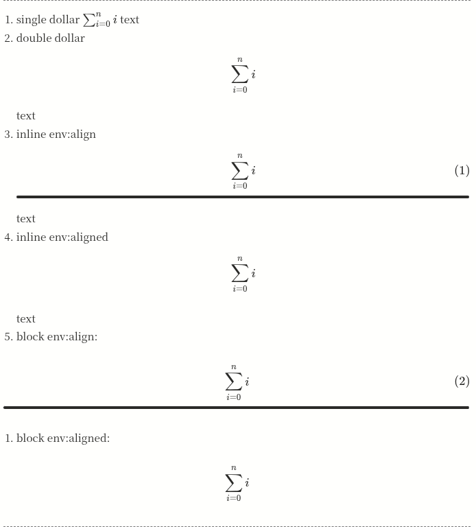
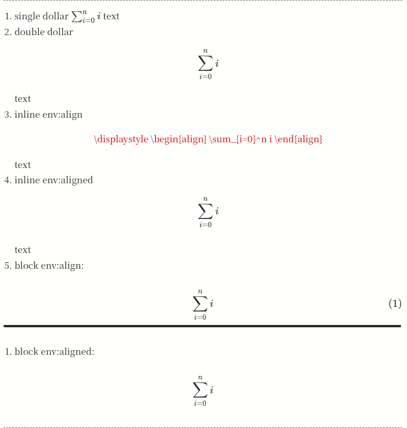
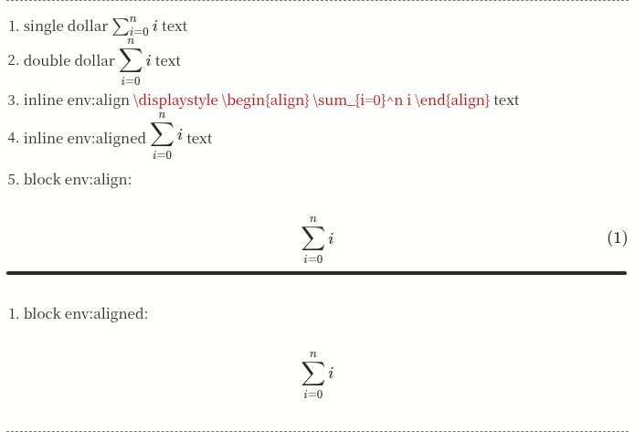
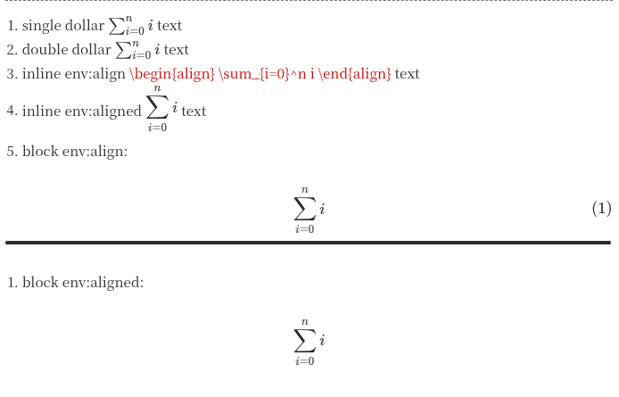

# Inline Display Math

A **remark plugin** that treats inline `$$...$$` as display math.

Normally, `remark-math` only recognizes display math when `$$...$$` appears as a block separated by line breaks.

This plugin allows display math to appear inline inside paragraphs, such as:

```
text $$x^2$$ text
```

and transforms the AST so the expression becomes a proper display math block.

---

## Install

```sh
pnpm add @tuyuritio/inline-display-math
```

---

## Usage

```ts
import inlineDisplayMath from "@tuyuritio/inline-display-math";
import remarkParse from "remark-parse";
import remarkRehype from "remark-rehype";
import rehypeStringify from "rehype-stringify";
import { unified } from "unified";

const processor = unified()
  .use(remarkParse)
  .use(inlineDisplayMath)
  .use(remarkRehype)
  .use(rehypeStringify);
```

---

## Options

| Option   | Type                                                       | Default    | Description |
| -------- | ---------------------------------------------------------- | ---------- | :---------: |
| `layout` | `"block"` \| `"display"` \| `"displaystyle"` \| `"inline"` | `"inline"` |     `-`     |

* `"block"`: convert inline `$$...$$` into block math (break paragraph structure)
* `"display"`: keep the structure, but render with display layout (centers math on its own line)
* `"displaystyle"`: keep the structure and inline layout, only apply `\displaystyle`
* `"inline"`: do nothing

For example, with given md:
```md
1. single dollar $\sum_{i=0}^n i$ text 

2. double dollar $$\sum_{i=0}^n i$$ text

3. inline env:align $$\begin{align} \sum_{i=0}^n i \end{align}$$ text

4. inline env:aligned $$\begin{aligned} \sum_{i=0}^n i \end{aligned}$$ text

5. block env:align: 
$$
\begin{align} \sum_{i=0}^n i \end{align}
$$

1. block env:aligned:
$$
\begin{aligned} \sum_{i=0}^n i \end{aligned}
$$
```

1. `block`



2. `display`



Error: ParseError: KaTeX parse error: {align} can be used only in display mode.

3. `displaystyle`



Error: ParseError: KaTeX parse error: {align} can be used only in display mode.

4. `inline`



Error: ParseError: KaTeX parse error: {align} can be used only in display mode.

---

## How It Works

Markdown math plugins typically require display math to be written as block elements:

```
$$
x^2
$$
```

However, authors frequently write expressions inline:

```
text $$x^2$$ text
```

In Markdown AST (mdast), this is parsed as an `inlineMath` node inside a paragraph.
Display math, however, must be represented as a `math` block node.

This plugin rewrites the AST so that inline `$$...$$` becomes a proper block math node.

The implementation was redesigned to operate at the **paragraph level**.

1. visits each paragraph node
2. scans its children
3. detects inline `$$...$$`
4. splits the paragraph into multiple blocks

For example:

```
text $$x^2$$ text
```

becomes:
- displaystyle:
  ```
  paragraph("text" math("\displaystyle x^2") "text")
  ```
- display:
  ```
  paragraph("text" span[class="katex-display"]( math("\displaystyle x^2") ) "text")
  ```
- block:
  ```
  paragraph("text")

  math("x^2")

  paragraph("text")
  ```

## License

[GPL-3.0-or-later](../../LICENSE)
